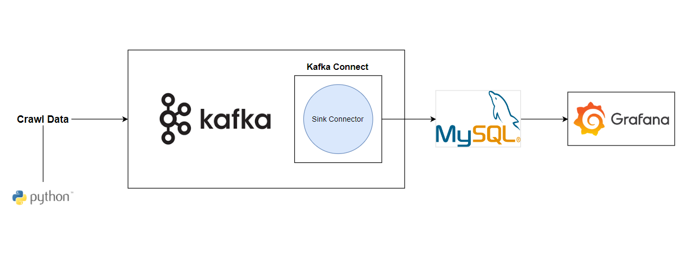
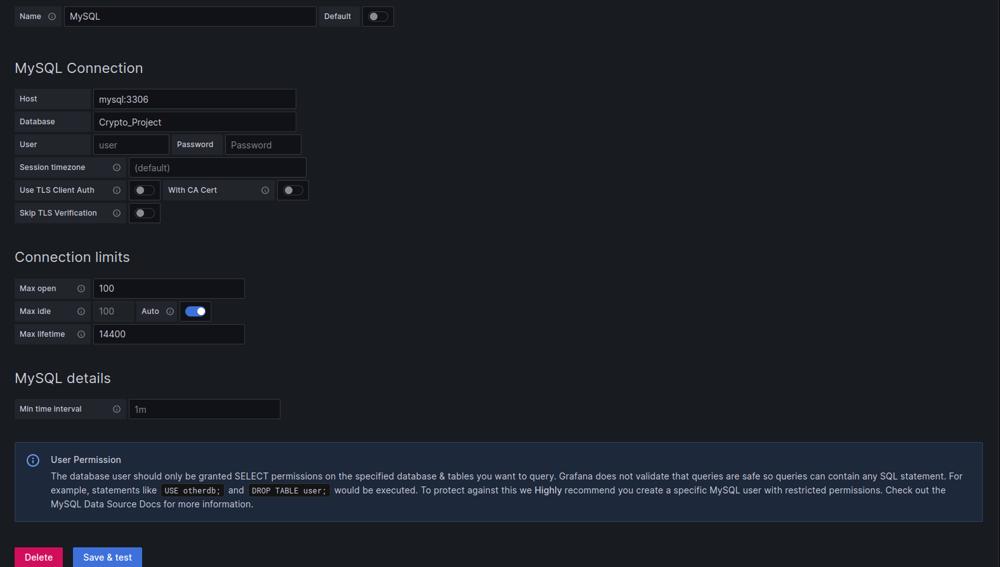
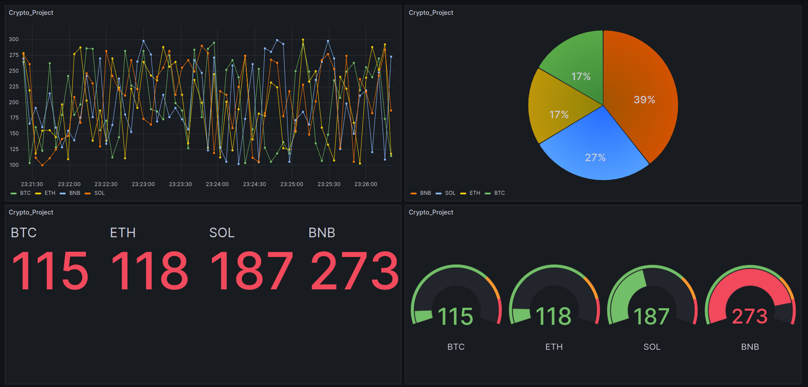

# Stream Processing : Real-time Price Cypto Coin
## Table of Contents
- [Stream Processing : Real-time Price Cypto Coin](#stream-processing--real-time-price-cypto-coin)
  - [Table of Contents](#table-of-contents)
  - [Introduction](#introduction)
    - [Technologies used](#technologies-used)
    - [Project Overview](#project-overview)
- [Setup](#setup)
  - [Build Docker Compose](#build-docker-compose)
  - [Using Grafana connect to MySQL](#using-grafana-connect-to-mysql)
  - [Dashboard](#dashboard)

## Introduction
### Technologies used
- Python
- Kafka 
- MySQL
- Grafana (visualization)
- Docker 
### Project Overview

***
# Setup
## Prerequisites
- Python (<= v3.9.10)
- JDK 11
- Docker
## Run
    git clone https://github.com/tmph2003/Crypto-Project.git
    #Build Docker Compose
    docker compose up -d
    #run python file
    python Craw_Coin_Price.py
## Using Grafana connect to MySQL
    localhost:3000
    username: admin
    password: admin

## Dashboard

